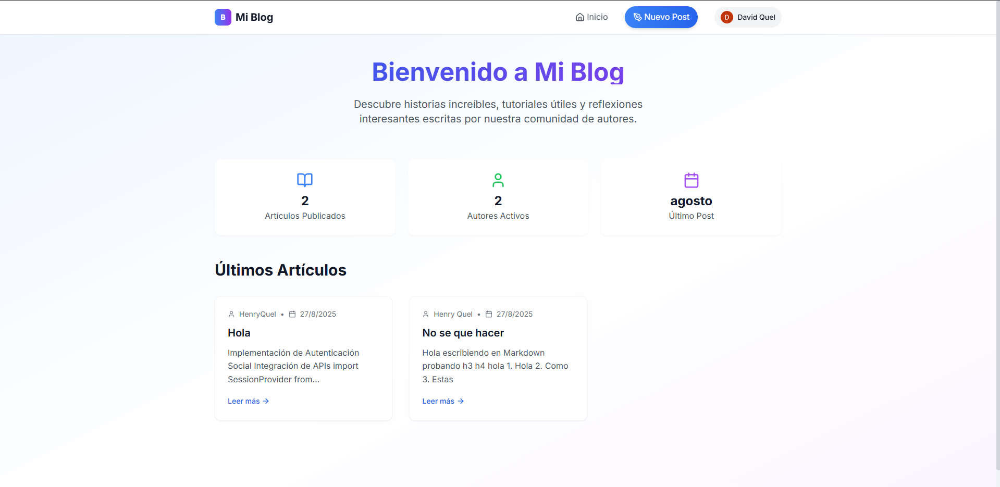
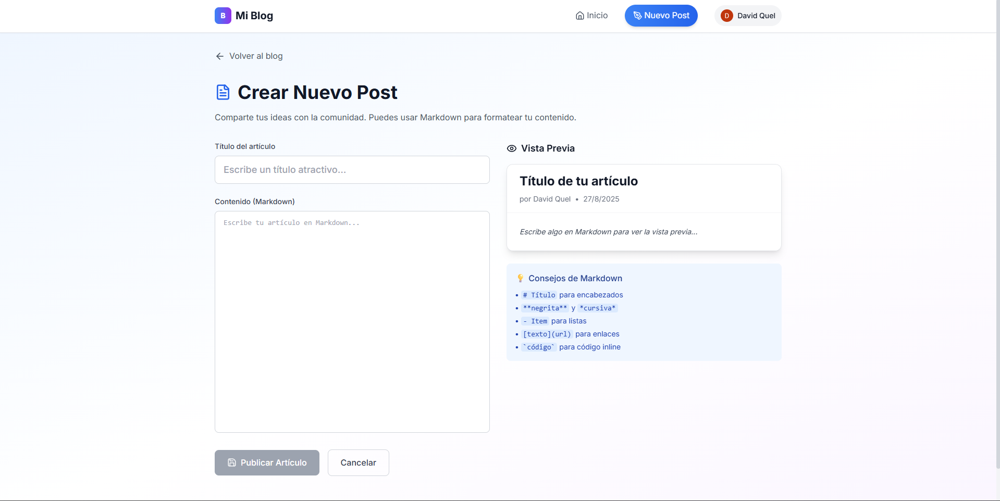
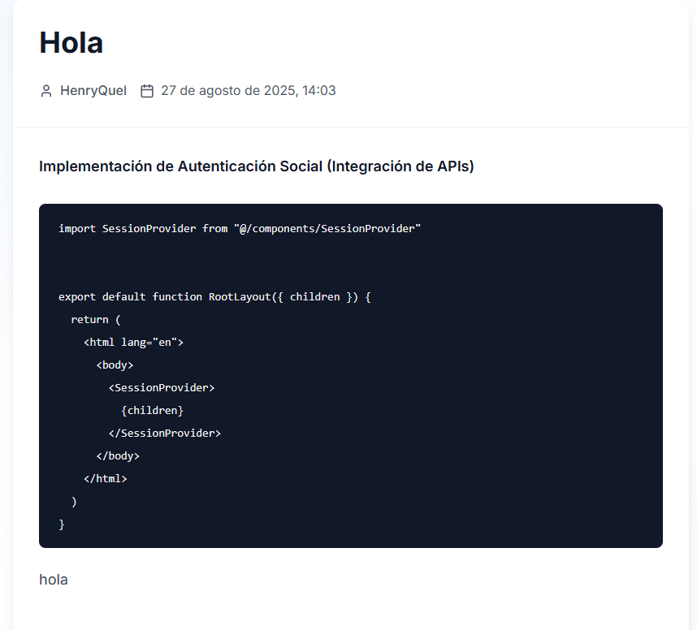

# Mi Blog

[Despliege en Vercel](https://mi-blog-hazel.vercel.app/)

**Mi Blog** es un proyecto construido con **Next.js 13**, usando **App Router**, autenticación social (Google y GitHub) y soporte para posts en **Markdown**.  
Permite a los usuarios loguearse, crear, editar y borrar posts de manera segura, con almacenamiento en **Supabase**.

---

## Características principales

- Autenticación social con Google y GitHub ✅
- Crear posts en Markdown con **vista previa en tiempo real** ✅
- Editar y borrar posts (solo el autor) ✅
- Lista de posts en la home, con enlaces a cada post individual ✅
- Protección de rutas: solo usuarios logueados pueden crear o editar posts ✅
- Renderizado seguro de Markdown (con sanitización básica) ✅
- Deploy automático en **Vercel** con variables de entorno configuradas ✅
- Base de datos en **Supabase** (Postgres) ✅

---

## Tecnologías utilizadas

- [Next.js 13](https://nextjs.org/) (App Router, TypeScript)  
- [NextAuth.js](https://next-auth.js.org/) para autenticación social  
- [Supabase](https://supabase.com/) para base de datos Postgres  
- [React Markdown](https://github.com/remarkjs/react-markdown) para renderizar Markdown  
- Axios para llamadas a la API  
- Tailwind para el diseño

---

## Estructura del proyecto

```
.
├── README.md
└── mi-blog
    ├── README.md
    ├── app
    │   ├── api
    │   │   ├── auth
    │   │   │   └── [...nextauth]
    │   │   │       └── route.ts
    │   │   └── posts
    │   │       ├── [id]
    │   │       │   └── route.ts
    │   │       └── route.ts
    │   ├── components
    │   │   ├── AuthButtons.tsx
    │   │   └── Navbar.tsx
    │   ├── favicon.ico
    │   ├── globals.css
    │   ├── layout.tsx
    │   ├── nuevo-post
    │   │   └── page.tsx
    │   ├── page.module.css
    │   ├── page.tsx
    │   ├── posts
    │   │   └── [id]
    │   │       ├── edit
    │   │       │   └── page.tsx
    │   │       └── page.tsx
    │   ├── protegida
    │   │   └── page.tsx
    │   └── providers.tsx
    ├── eslint.config.mjs
    ├── lib
    │   └── supabaseClient.ts
    ├── next-env.d.ts
    ├── next.config.ts
    ├── package-lock.json
    ├── package.json
    ├── postcss.config.js
    ├── public
    │   ├── file.svg
    │   ├── globe.svg
    │   ├── next.svg
    │   ├── vercel.svg
    │   └── window.svg
    ├── tailwind.config.js
    └── tsconfig.json

16 directories, 31 files
````

---

## 🔑 Configuración de variables de entorno

Crea un archivo `.env.local`:

```env
GOOGLE_CLIENT_ID=tu_google_client_id
GOOGLE_CLIENT_SECRET=tu_google_client_secret

GITHUB_ID=tu_github_client_id
GITHUB_SECRET=tu_github_client_secret

NEXT_PUBLIC_SUPABASE_URL=https://tu_proyecto.supabase.co
NEXT_PUBLIC_SUPABASE_ANON_KEY=tu_anon_key
````

> Asegúrate de **no subir este archivo** a GitHub.

---

## ⚡ Uso

1. Clonar el proyecto:

```bash
git clone https://github.com/HenryD11703/mi-blog.git
cd mi-blog
```

2. Instalar dependencias:

```bash
npm install
```

3. Correr en modo desarrollo:

```bash
npm run dev
```

4. Abrir en el navegador:

```
http://localhost:3000
```

5. Login con Google o GitHub → crear, editar o borrar posts.

--- 

## 📷 Screenshots

* Home / lista de posts:

* Crear post en Markdown:

* Vista individual de post: `[Imagen del post][]`



